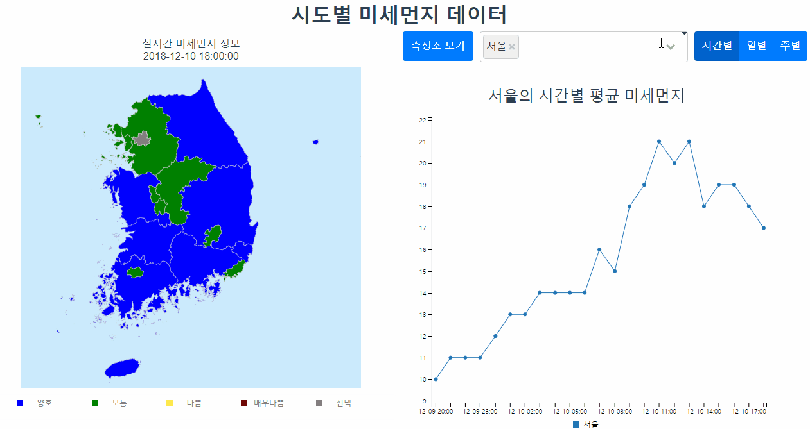
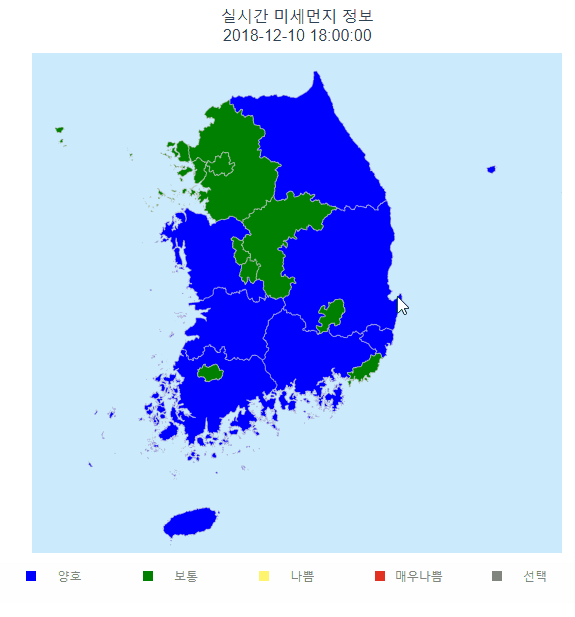
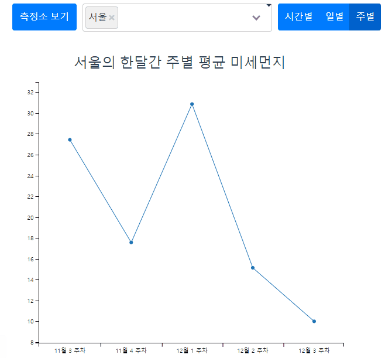
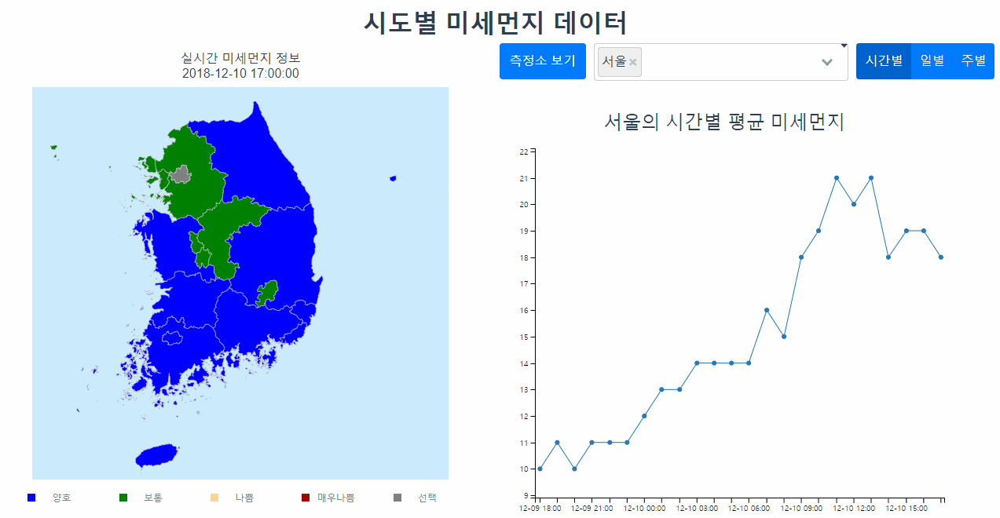

# 목차
1. [바로 서버 구동하기](#바로-서버-구동-하기)

2. [사용 라이브러리 및 툴, 기타사항](#사용-라이브러리-및-툴-기타-사항)
3. [테스트 서버](#테스트-서버)
4. [구성 환경 및 요구 사항](#구성-환경-및-요구-사항)
5. [프로젝트 빌드](#프로젝트-빌드)
6. [데몬 설정](#데몬-설정)
7. [실행 화면 및 기능](#실행-화면-및-기능)
8. [폴더 및 파일 명세](#폴더-및-파일-명세)


## 빌드한 결과 및 소스 코드
- [서버 소스 코드](server/)
- [클라이언트 소스 코드](client/)
- [서버 빌드 결과 (api.war)](build/api.war)
- [클라이언트 빌드 결과](build/dist)


# 바로 서버 구동 하기

- docker-compose로 바로 구동하기

저희 팀은 docker-compose를 통해 자동화가 다 되어 있습니다. 
손 쉽게 아래의 명령어를 docker-compose.yml이 있는 폴더에서 수행하면 바로 구동하실 수 있습니다.
```
$ sudo docker-compose pull
$ sudo docker-compose up
```
혹은 [테스트 서버](#테스트-서버)를 확인하세요.

- docker 따로 따로 구동하는 경우
```
$ sudo docker run --name db hyeonjames/mysql:latest
$ sudo docker run --name was -e MYSQL_NAME=my_db --link db:my_db hyeonjames/tomcat:latest 
$ sudo docker run --name web -p 80:80 -e TOMCAT_NAME=my_was --link was:my_was hyeonjames/apache:latest 
```

# 사용 라이브러리 및 툴 기타 사항

- 과제 체크리스트
  - [x] docker 사용 - httpd(apache2), mysql, tomcat 폴더 내에 각각 Dockerfile 이 설정되어 있고 docker-compose로 빌드 및 구성
  - [x] Apache2 & Tomcat 연동 - Apache 이미지 생성할 때 mod_jk를 다운 받고 이를 적용해 톰켓과 연동을 자동으로 하게 설정함. ( **httpd /Dockerfile** )
  - [x] MySQL 연동 - mysql 8버전 사용
  - [x] Vue.js 사용 - 클라이언트는 Vue 프로젝트로 되어 있음.
  - [x] Billboard.js 사용 - 차트 그리기
  - [x] D3.js 사용 - 대한민국 지도를 그릴때 사용

- python : 서버 빌드 자동화
  - build.py 를 통해 모든 빌드를 자동으로 수행
  - setup.py 를 통해 빌드 및 도커 컨테이너 수행
- **docker** : 서버 가상화
- docker-compose : 다중 서버 가상화 및 자동화 ( docker-compose up으로 모든 서버 실행 )
    - **httpd(Apache)** : 정적 웹서버 구동.
      - mod_jk로 **tomcat서버와 연동**합니다. 
      - **tomcat** 서버의 호스트 이름 (컨테이너 이름)은 TOMCAT_NAME 환경변수를 넘기면 됩니다. (docker-compose.yml 에서 설정)
    - **tomcat** : 동적 WAS 서버
      - dockerize : MySQL 서버가 구동 될때까지 대기
      - OPEN_API_KEY 환경변수는 [공공 데이터 포탈](https://www.data.go.kr/) 에서 받은 API키 입니다.
        - [대기오염 정보 조회 서비스](https://www.data.go.kr/dataset/15000581/openapi.do) 와 [측정소 정보 조회 서비스](https://www.data.go.kr/dataset/15000660/openapi.do?mypageFlag=Y) 가 필요합니다.
    - **mysql** : 데이터 베이스 
- **Spring boot** - JPA를 이용해 **Mysql 서버에서 데이터를 액세스** 하고 이를 클라이언트에게 전달하는 api서버 역할을 함
    - 미세먼지 데이터 오픈 Api : 우리나라 미세먼지 데이터 조회를 위해 사용됨. 
    - API키가 필요합니다. docker-compose.yml 에서 'OPEN_API_KEY' 환경 변수로 변경 가능.

- **Vue.js** : 클라이언트 단 처리 목적
    - vue-cli 유틸 : Vue 프로젝트를 자동으로 생성해주는 유틸.
        - webpack / babel : *.vue 파일, js , html 등을 컴파일
    - **d3.js** : 우리나라 도시를 구분하는 맵을 그림
    - **billboard.js** : 도시별로 미세먼지 정보를 주별/일별/시간별 평균을 조회할 수 있음
    - kakao map api( Daum 맵 api ) : Geolocation을 이용해 현재 사용자가 살고 있는 곳의 좌표를 가져오고 카카오 맵 api를 이용해 현재 도시를 알아냄 , API 키 필요 


# 테스트 서버

http://ec2-13-209-117-20.ap-northeast-2.compute.amazonaws.com

에 접속하시면 됩니다.
AWS 프리티어 (micro 서버)를 사용하고 있기에 원활하지 않을 수 있습니다.

# 구성 환경 및 요구 사항 
- Windows 10 Pro 에서 됨을 확인 했습니다. Windows 10 Home 버전 Docker-Toolbox를 쓴 버전에서는 잘 되지 않을 수 있습니다. 
- Ubuntu 18.04에서 작동함을 확인 했습니다.
- 서버는 램을 어느정도 먹기에 최소 램 2GB 이상의 시스템을 권장 합니다.
- Chrome 에 최적화 되어 있습니다. d3 지도 맵 그리는게 조금 느릴 수 있음.

# 프로젝트 빌드

프로젝트를 빌드 하기 위해서는 **docker** , **docker-compose**, **npm**, **java** **python**이 있어야 합니다.

[도커 설치](https://www.docker.com/get-started)

[노드 설치](https://nodejs.org)

[파이썬 설치](https://www.python.org)

우분투 기준으로
```
$ curl -ssL get.docker.com | sh
$ sudo apt-get update
$ sudo apt-get install docker-compose nodejs npm default-jre python3
```

도커와 노드, 파이썬,자바를 설치 했으면, 

파이썬으로 setup.py를 실행하면 설치를 바로 하실 수 있습니다. ( 빌드만 하고 싶으실 경우 build.py만 실행해주세요. )

기본적으로 80포트를 기준으로 서버가 열립니다. 

이를 수정하시려면 docker-compose.yml 에 httpd>ports에 80:80을 원하는포트:80 으로 바꿔주세요.

단, 포트를 바꾸면 kakao map api가 작동 안할 수 있습니다. 


```
$ sudo python3 setup.py
```

setup.py는 다음과 같은 작업을 합니다.

1. client 폴더에서 npm update로 클라이언트 dependency 패키지 설치
2. npm run build로 vue 프로젝트 빌드 -> client\dist 폴더에 빌드된 파일들이 생성됨
3. server 폴더에서 gradlew build 수행 -> 서버 dependency 패키지 설치 및 war 생성
    - build\libs 에 api.war 생성
4. docker 이미지 안으로 빌드된 파일들을 넣기 위해 복사함
    - client\dist -> httpd\dist 로 복사됨 -> 이미지 생성시 /var/www/html로 복사됨
    - server\build\libs\api.war -> tomcat\api.war로 복사됨 -> 이미지 생성시 톰캣 내 webapps/api.war로 복사됨
5. docker-compose build 수행 ( 도커 이미지 생성 )
    - 각각 폴더에 있는 Dockerfile 을 기준으로 도커 이미지가 생성
    - tomcat의 경우 tomcat 설치 및 api.war을 deploy,  dockerize 설치
    - httpd 의 경우 apache2 설치 후 tomcat 연결을 위한 환경 설정 파일 적용
    - mysql 의 경우 mysql 설치 후 기본 인코딩 설정 변경 (custom.cnf), initial.sql 수행( 컨테이너 실행시 데이터가 하나도 없는 경우 수행 )
6. docker-compose up 수행 ( 도커 컨테이너 생성 )
    - tomcat, mysql, httpd 3개의 컨테이너가 생성됨


# 데몬 설정
**우분투 기준입니다**
build.py를 통하여 프로젝트 및 도커 빌드합니다.

```
$ sudo python build.py
```

dustdocker 파일을 /etc/init.d 에 옴겨주시고 chmod로 권한을 설정해주세요.

```
$ sudo cp ./dustdocker /etc/init.d/
$ sudo chmod 755 /etc/init.d/dustdocker
```

dustdocker 파일안에 있는 DUST_PATH 값을 프로젝트 폴더로 바꿔주세요 ( startup.sh 가 있는 폴더 )

그 다음은 update-rc.d 로 데몬을 설정해주면 됩니다.

```
$ sudo update-rc.d dustdocker defaults
$ sudo systemctl enable dustdocker
```

아래처럼 service 명령어로 dustdocker를 start하면 서비스가 실행됩니다

```
$ sudo service dustdocker start
```


# 실행 화면 및 기능

접속 시 사용자의 해당 위치를 기반으로 정보를 불러옵니다.  
지도에서 시도를 클릭하여 선택하거나 선 그래프 위의 셀렉트 바를 사용하여 원하는 시도를 선택하면 선택된 시도의 미세먼지 평균 데이터를 그래프로 볼 수 있습니다. (여러개의 시도를 선택 할 수 있습니다.)  


화면은 지도, 선 그래프 크게 2가지로 구성되어 있습니다.  
### 지도
  
  지도는 실시간 미세먼지 정보를 불러와 농도별로 좋음, 양호, 나쁨, 매우나쁨을 색으로 표현해줍니다.
  시도 위에 마우스를 올리면 실시간 미세먼지 정보를 불러와 줍니다.  
  
  
### 선그래프

  선그래프는 선택된 도시에 대하여 오늘의 시간별 미세먼지 평균 데이터, 일주일간 일별 미세먼지 평균 데이터, 한달간 주별 미세먼지 평균 데이터를 보여줍니다.  
    


또한 하나의 시도를 선택 한 뒤, _측정소 보기_ 버튼을 클릭하면 각 시도의 미세먼지 측정소의 주소를 볼 수 있습니다.    
해당 주소를 클릭하면 다음 카카오 지도페이지로 넘어갑니다.  




# 폴더 및 파일 명세
- build (folder) : 클라이언트, 서버 각각 빌드한 결과물 (제출용)
- client (folder) : 클라이언트 소스 폴더 (Vue Project)
- httpd (folder) : Apache 2.4 설치와 톰켓을 연동하는 환경 설정을 자동으로 해주는 도커 이미지 빌드 설정 파일들 ([Dockerfile](httpd/Dockerfile) 참조) 
- mysql (folder) : Mysql 8버전 설치와 초기 데이터 구성을 해주는 도커 이미지 빌드 설정 파일들 ([Dockerfile](mysql/Dockerfile) 참조)
- server (folder) : 서버 소스 폴더 (Spring Boot)
- tomcat (folder) : 톰켓 설치와 서버 빌드한 결과 Deploy를 자동으로 해주는 도커 이미지 빌드 설정 파일들 ([Dockerfile](tomcat/Dockerfile) 참조)
- build.py : 모든 빌드 ( 클라이언트 빌드 , 서버 빌드, 도커 이미지 빌드 ) 해주는 파이썬 스크립트
- setup.py : 모든 빌드 수행 후 docker 서버들 수행
- startup.sh : 서버를 실행함 ( 모두 빌드한 상태에서 수행 )
- dustdocker : 우분투 기준 데몬 스크립트 파일 [데몬 설정](#데몬-설정) 참조